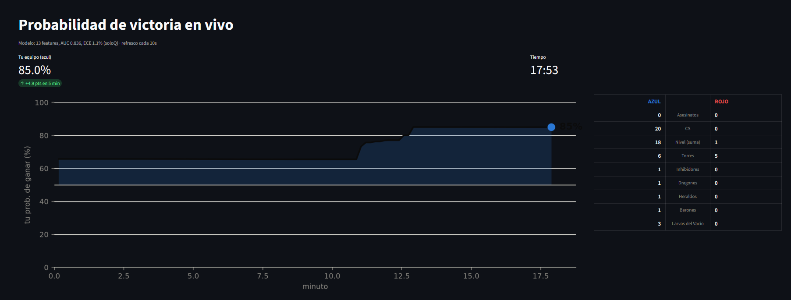
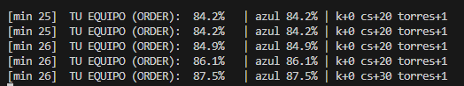

# A League of Legends Win Prediction Model

**Probabilidad de victoria en League of Legends, minuto a minuto, en vivo.**

Lee la partida que tienes abierta en el cliente y te dice tu probabilidad de ganar,
actualizada cada 10 segundos. No se instala nada en el juego ni se toca la memoria:
todo sale de la API local que el propio cliente de Riot ya expone.



## Qué es

Un modelo entrenado con **7.956 partidas de soloQ** que estima, a cada minuto, la
probabilidad de que gane cada equipo a partir de 13 señales del estado de la partida:
asesinatos, CS, nivel, torres, inhibidores, dragones, heraldos, barones, larvas del
vacío y el *momentum* de los últimos 5 minutos.

Lo importante no es acertar quién gana, sino que **el número signifique algo**: de
todas las veces que dice "70%", gana el ~70%.

| | |
|---|---|
| **ECE** (fiabilidad) | **1.1%** |
| ROC-AUC | 0.836 |
| Dataset | 7.956 partidas soloQ / 186.635 filas (EUW) |
| Modelo | GradientBoosting, 13 features |

## Requisitos

- Python 3.10+
- **Para el modo en vivo:** League of Legends instalado en este mismo PC. Nada más.
- **Para entrenar de cero:** una API key de [developer.riotgames.com](https://developer.riotgames.com/).

## Instalación

```bash
git clone <este-repo>
cd league_model
pip install -r requirements.txt
```

Si solo quieres el modo en vivo, ya está: el modelo entrenado viene en `models/`.

Para descargar datos y entrenar, además:

```bash
cp .env.example .env      # y pon tu API key dentro
```

## Uso

### Ver tu win% en vivo

Entra a una partida y lanza el dashboard:

```bash
streamlit run live_dashboard.py
```

Se queda esperando y arranca solo en cuanto detecta una partida. Verás tu
probabilidad de ganar, cómo ha cambiado en los últimos 5 minutos, la curva de toda
la partida y el marcador de objetivos de cada equipo.

En la curva, el área se pinta **del color del bando que va por delante** y la altura
es siempre *tu* probabilidad, juegues en azul o en rojo.

O en consola, si prefieres algo ligero:

```bash
python live_predict.py
```



> Funciona en **cualquier modo**: ranked, normal, custom y practice tool. Pero el
> modelo se entrenó con soloQ 5v5, así que en una custom contra bots la tubería
> funciona pero el número no significa nada.

### Entrenar tu propio modelo

```bash
python crawler.py           # descarga partidas de la Riot API (reanudable)
python build_features.py    # construye features.csv
python train.py             # entrena, evalúa y guarda el modelo
```

El crawler tarda **varias horas** para 10.000 partidas: son dos peticiones por
partida y las development key tienen límites bajos. Además **caducan cada 24 h**: si
ves un 401, renuévala en el portal y relanza — va reanudando por donde iba.

Puedes cambiar la banda de elo y la región tocando las constantes del principio de
`crawler.py` (`SEED_TIERS`, `PLATFORM`, `REGION`).

### Experimentos

```bash
python -m experiments.calibrate       # ¿hace falta calibrar la salida? (no)
python -m experiments.queue_ablation  # cuánto cuesta entrenar con colas que no son soloQ
python -m experiments.train_lstm      # ¿ayuda un modelo secuencial? (tampoco)
```

## Cómo funciona

```
Riot API  ──crawler.py──>  matches/ + timelines/  ──build_features.py──>  features.csv
                                                                               │
                                                                          train.py
                                                                               v
cliente local ──Live Client Data API──> live_predict.py <── modelo_baseline.joblib
                                              │
                                              v
                                        tu win% cada 10s
```

El entrenamiento sale del **timeline** de cada partida, no del match JSON: el match
es un resumen de fin de partida y usarlo sería hacer trampa. De cada timeline se
extrae una fila por minuto con el estado del juego a ese minuto.

Las 13 features son deliberadamente **las que también existen en vivo**. No usa oro
ni experiencia, aunque los tenga el timeline, porque la API local no los da para los
10 jugadores: entrenar con ellos daría un modelo imposible de servir. Cuesta menos
de lo que parece (−0.002 de AUC), porque el oro es en el fondo un resumen de cs,
asesinatos y objetivos, que sí conservamos.

| Fichero | Qué hace |
|---|---|
| `crawler.py` | Descarga match + timeline. Reanudable. |
| `build_features.py` | Timeline → `features.csv` (una fila por minuto × partida). |
| `train.py` | Entrena, evalúa y guarda el modelo. |
| `live_predict.py` | Núcleo del modo en vivo + modo consola. |
| `live_dashboard.py` | Dashboard Streamlit. |
| `experiments/` | Cosas probadas y aparcadas, cada una con su conclusión. |
| `notebooks/eda.ipynb` | Análisis exploratorio. |

Todo se ejecuta desde la raíz del repo.

## Qué tan fiable es el número

Medido sobre 37.320 filas de test que el modelo nunca vio (el split es **por
partida**, nunca por fila, o los minutos de un mismo match se filtrarían entre train
y test):

| Dice | Gana de verdad | n |
|---:|---:|---:|
| 5.1% | 4.4% | 5.057 |
| 14.8% | 14.7% | 3.666 |
| 25.1% | 28.5% | 3.701 |
| 35.0% | 35.7% | 4.234 |
| 44.9% | 46.4% | 3.880 |
| 55.0% | 54.3% | 3.634 |
| 64.9% | 64.9% | 3.408 |
| 74.9% | 74.3% | 3.111 |
| 85.1% | 84.1% | 3.085 |
| 94.8% | 95.8% | 3.544 |

El modelo sale calibrado de fábrica y aplicarle isotonic o sigmoid lo **empeora**
(ECE 1.1% → 2.2% / 2.1%), así que no se calibra.

## Limitaciones

- **Solo soloQ 5v5.** Arena, ARAM y co-op vs IA no son el mismo juego: otras reglas,
  otros objetivos, otro mapa. El número no vale ahí.
- **El elo importa.** El modelo actual está entrenado con partidas de elo alto. En
  elo bajo las ventajas se convierten peor, así que el mismo estado merece una
  probabilidad más cerca del 50%: servido fuera de su banda, el modelo se pasa de
  confiado. Si juegas en otro rango, recrawlea tu banda con `SEED_TIERS`.
- **Hay un techo.** Rondar el 0.84 de AUC no es falta de modelo: las partidas de LoL
  conservan incertidumbre real y el estado a un minuto dado no determina el
  resultado. Más datos, tuning, LightGBM y una LSTM no lo movieron.
- **Las development key caducan cada 24 h.** Solo afecta al crawler; el modo en vivo
  no usa la Riot API, solo la local.

## Créditos

Datos de la [Riot Games API](https://developer.riotgames.com/). Este proyecto no
está avalado por Riot Games ni refleja sus opiniones.
